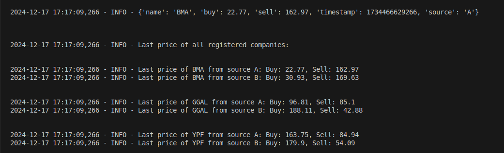

# Challenge_Manejo-de-cotizaciones
Ejercicio sobre manejo de cotizaciones Soluciones Algoritmicas SA

Resolucion:
Se definen dos diccionarios, uno para cada source, los cuales contienen como clave
el nombre de la compañia y como valor una lista para la cual cada elemento es una 
tupla de 3 elementos: (buy, sell, timestamp). De esta manera se mantiene el registro
completo de todos los datos que llegaron, ya que se van agregando a la lista. El ultimo
elemento de la lista es el que va a tener los valores de compra y venta mas actuales

La funcion loop itera infinitamente, como se pide, leyendo datos, imprimientodolos y 
almacenandolos en el diccionario correspondiente. Por cada iteracion se imprimen todos
los ultimos valores de todas las compañias para ambos sources.

Para simular la entrada de datos la funcion generate_input() devuelve el tipo de dato que
pide la consigna

Para mas ilustracion, en esta imagen se puede ver una iteracion del loop:
